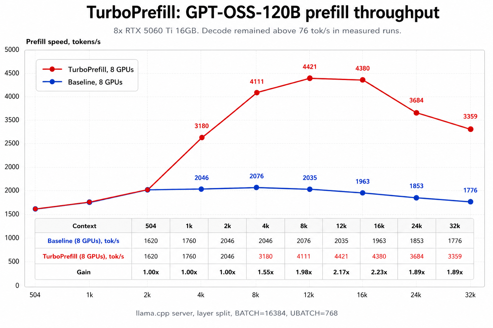
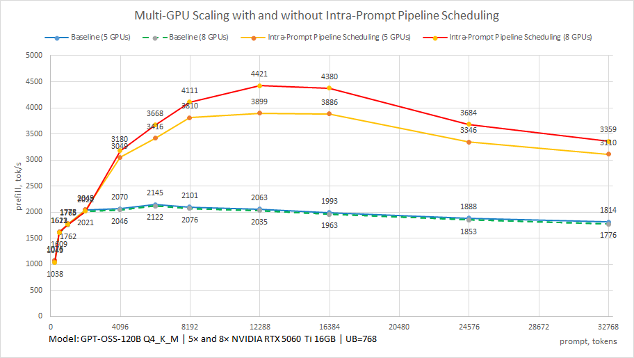
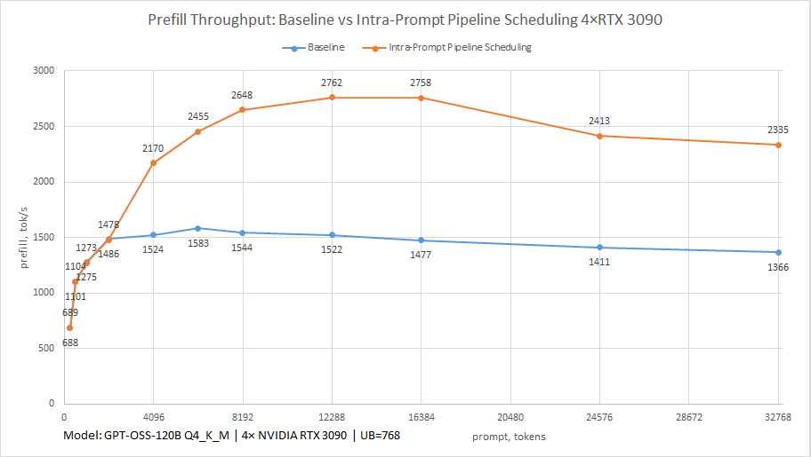
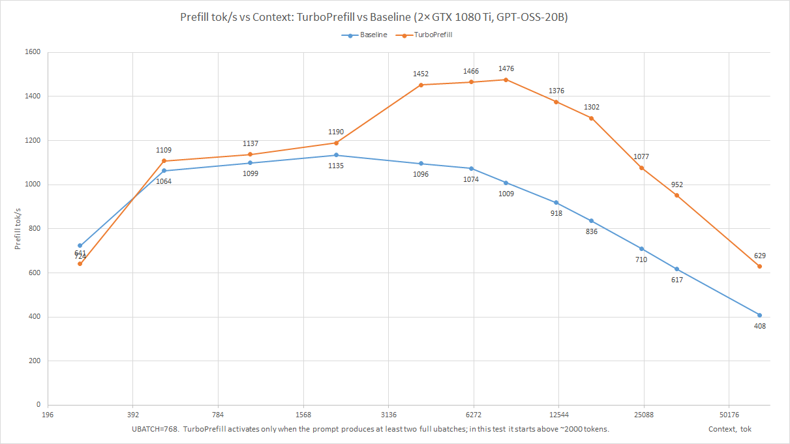

# TurboPrefill
[](https://github.com/sergey-automation/TurboPrefill/releases)

TurboPrefill is the first public Proof-of-Concept implementation of Intra-Prompt Pipeline Scheduling for Multi-GPU Prefill.

Further development of the project supports multi-user mode, Vision Language Models (VLM), and has been validated on modern high-performance GPUs. The latest version is available [here](https://github.com/sergey-automation/TurboPrefill-VLM-Validation).

For a detailed architectural discussion, see:
[RFC: Intra-Prompt Pipeline Scheduling for Multi-GPU Prefill](doc/rfc_turboprefill.md)

Multi-GPU prefill acceleration for llama.cpp.

This repository contains a file overlay for llama.cpp and helper scripts for running `llama-server` benchmarks.

## Performance Benchmark (GPT-OSS-120B)



### Summary Results
| Prompt Tokens | Baseline (8x GPU) tok/s | TurboPrefill tok/s | Speedup Gain |
| :--- | :---: | :---: | :---: |
| 255 | 1038| 1043 | **1.00x** |
| 504 | 1609 | 1613 | **1.00x** |
| 1017 | 1762 | 1765 | **1.00x** |
| 2044 | 2021 | 2022 | **1.00x** |
| 4076 | 2046 | 3180 | **1.55x** |
| 6142 | 2122 | 3668 | **1.73x** |
| 8164 | 2076 | 4111 | **1.98x** |
| 12280 | 2035 | 4421 | **2.17x** |
| 16373 | 1963 | 4380 | **2.23x** |
| 24560 | 1853 | 3684 | **1.99x** |
| 32761 | 1776 | 3359 | **1.89x** |

# How TurboPrefill Was Created

For more than 20 years, I worked on the design, construction, and optimization of custom industrial production lines and control systems.

While experimenting with running local AI models using llama.cpp on multi-GPU systems in layer-split mode, I noticed a well-known characteristic of long-context prefill execution.

In layer-split mode, the model is distributed across multiple GPUs by layers. Under the standard execution path, each ubatch passes sequentially through all model layers. As a result, some GPUs remain idle while waiting for the previous ubatch to complete processing through the remaining layers.

While analyzing the scheduler's behavior, I began asking a simple question: does prefill really require waiting for the previous ubatch to traverse the entire model before the next ubatch can begin?

For decode, such a dependency does exist. However, during prefill, the next ubatch can start processing on a layer immediately after the previous ubatch has finished on that layer, without waiting for it to complete the entire model.

To test this idea, I created an experimental execution path that later became TurboPrefill.

The core idea is not to modify the model, mathematical computations, or attention algorithms. TurboPrefill changes only the scheduling strategy used to process a series of ubatches inside the scheduler.

If GPUs are viewed as stations on a production line, the standard approach sends one workpiece through every station before starting the next one. As a result, parts of the equipment periodically sit idle while waiting for previous stages to finish.

TurboPrefill is intended to keep multiple ubatches active within the pipeline simultaneously. This allows each GPU to begin processing the next ubatch as soon as its own work is complete, without waiting for the previous ubatch to finish across the entire GPU chain.

In simplified form:

Standard scheduler:

```text
step    1234567890123
GPU(1)  #000#000#0000
GPU(2)  0#000#000#000
GPU(3)  00#000#000#00
GPU(4)  000#000#000#0
```

TurboPrefill:

```text
step    1234567
GPU(1)  ###0000
GPU(2)  0###000
GPU(3)  00###00
GPU(4)  000###0
```

TurboPrefill does not modify model weights, computations, or inference results. Only the execution order of prefill workloads inside the scheduler is changed.

As a result, idle time between processing stages can be reduced and higher prefill performance can be achieved on long contexts while preserving identical model outputs.

TurboPrefill is not intended to be a universal accelerator for all llama.cpp workloads.

It is specifically designed for long single-request prefill workloads running in multi-GPU layer-split mode, where underutilization of available hardware is most visible.

The idea behind TurboPrefill did not come from modifying the mathematical side of the model. It came from viewing multi-GPU inference as a production pipeline, where the primary focus is hardware utilization, reducing idle time, and improving overall system throughput.

# Why TurboPrefill Works Only for Certain Workloads

TurboPrefill was not designed as a universal acceleration path for every llama.cpp workload.

Instead, it focuses on a specific scenario where the potential benefit is highest: long-context prefill of a single request running on multiple GPUs in layer-split mode.

TurboPrefill can be used in multi-user servers; the scheduling logic operates on individual requests, rather than users.

The reason is simple. TurboPrefill relies on the ability to observe and schedule a series of consecutive ubatches that belong to the same request. This allows multiple ubatches to be active within the pipeline at the same time and reduces idle periods between neighboring processing stages.

Many other workloads do not provide the same opportunity.

For example:

* Decode workloads have stronger dependencies between consecutive tokens.
* Single-GPU execution does not suffer from inter-GPU pipeline bubbles.
* Embedding workloads follow a different execution pattern.
* Multi-sequence batches introduce additional scheduling constraints.
* Non-layer-split configurations do not expose the same pipeline structure.

For this reason, TurboPrefill does not attempt to replace the standard llama.cpp scheduler.

Instead, a dispatcher in `llama-context.cpp` evaluates each workload and decides whether it matches the conditions required for TurboPrefill. Workloads that do not match these conditions continue to use the standard execution path.

This behavior is intentional.

The goal of TurboPrefill is not to accelerate every possible workload. The goal is to improve utilization and throughput in a specific execution pattern where unused pipeline capacity is most visible.

## Why Some Workloads Are Excluded

| Workload             | Reason                                                     |
| -------------------- | ---------------------------------------------------------- |
| Decode               | Strong dependencies between consecutive tokens             |
| Single GPU           | No inter-GPU pipeline to optimize                          |
| Embeddings           | Different execution pattern                                |
| Multi-sequence batch | Additional scheduling complexity                           |
| Non-layer-split mode | No layer pipeline between GPUs                             |
| Short prefill        | Insufficient number of ubatches to benefit from scheduling |


TurboPrefill focuses on workloads where pipeline underutilization is most visible and where scheduling multiple ubatches can improve overall throughput.
### Note about llama-bench

The standard `llama-bench pp*` benchmark does not represent a pure long-context prefill workload.

A token output is requested at the end of each benchmark prompt, which causes the request to follow the standard execution path instead of the TurboPrefill path.

For this reason, dedicated benchmark scripts are used in this repository to measure TurboPrefill performance on long-context prefill workloads.

# How TurboPrefill Works
The standard llama.cpp scheduler processes each ubatch independently.

A ubatch enters the pipeline, passes through all model layers, and only then the next ubatch begins its full journey through the pipeline.

In layer-split mode this creates a familiar pipeline behavior: some GPUs are busy while others are waiting for work to arrive from previous stages.

TurboPrefill introduces an alternative execution path for eligible long-context prefill workloads.
The execution consists of two phases:

### Capture Phase

Instead of immediately executing each eligible ubatch through the entire pipeline, TurboPrefill temporarily stores information about a sequence of consecutive ubatches belonging to the same request.
This creates a batch of work that can later be scheduled as a whole.

### Replay Phase

After the capture phase is complete, the stored ubatches are replayed through the multi-GPU pipeline.
Instead of processing one ubatch completely before starting the next one, TurboPrefill plans execution so that multiple ubatches can be active at different pipeline stages at the same time.

Conceptually:

```text
Standard:

ubatch1 -> all layers
ubatch2 -> all layers
ubatch3 -> all layers
```
TurboPrefill:
```text
wave1: ubatch1
wave2: ubatch2 + ubatch1
wave3: ubatch3 + ubatch2 + ubatch1
...
```
This allows more GPUs to remain active simultaneously and reduces idle periods between neighboring pipeline stages.

The model, weights, attention algorithms, and numerical results remain unchanged.
Only the execution schedule is different.

## Architecture Overview

```text
Request
   |
   v
Prefill Phase
   |
   v
UBatch Classification
   |
   +--------------------------+
   |                          |
   v                          v
Standard Path         Intra-Prompt Pipeline
                      Scheduling
                               |
                               v
                       UBatch Accumulation
                               |
                               v
                       Capture / Replay
                               |
                               v
                      Layer-Split GPU Pipeline
                               |
                               v
                      ggml-backend-sched
```
  
## Additional Benchmarks

# Context Length Scaling

One of the main goals of TurboPrefill is to improve utilization of multi-GPU layer-split pipelines during long-context prefill workloads. 

The expected behavior is that the benefit grows as the prompt becomes longer. Longer prompts generate more ubatches, providing more opportunities to keep multiple stages of the pipeline active simultaneously. 

To evaluate this effect, GPT-OSS-120B was tested across multiple context lengths using the same hardware and execution settings.

The results show that TurboPrefill provides limited benefit on shorter prompts and increasing benefit as context length grows. 

This behavior is consistent with the original design goal of reducing pipeline idle time during long-context prefill workloads. 

The largest improvement observed in these tests was approximately 2.23× compared to the standard execution path. 


# Scaling with GPU Count

TurboPrefill is designed for multi-GPU layer-split execution, therefore it is important to evaluate how its behavior changes as the number of GPUs changes. 

The tests below compare the same GPT-OSS-120B model running on 5 and 8 RTX 5060 Ti 16GB GPUs using identical execution settings. 

The results show two effects:

1. Increasing the number of GPUs improves absolute prefill throughput.
2. TurboPrefill continues to provide substantial acceleration on both configurations.

2× NVIDIA **RTX PRO 5000 (Blackwell)** 




The highest measured gains were:

### TurboPrefill Speedup over Pipeline Parallel at 16k Context Tokens

| Configuration | Model | Baseline (tok/s) | TurboPrefill (tok/s) | Speedup |
|---------------|-------|-----------------:|---------------------:|---------:|
| **2**× RTX PRO 5000  | Llama-3-70B | 923 | 1572 | **1.7×** |
| **2**× GTX 1080 Ti | GPT-OSS-20B | 836 | 1302 | **1.6×** |
| **4**× RTX 3090 | GPT-OSS-120B | 1477 | 2758 | **1.9×** |
| **4**× RTX 3090 |Llama-3-70B  | 400 | 1208 | **3.0×** |
| **5**× RTX 5060 Ti | GPT-OSS-120B | 1993 | 3886 | **1.9×** |
| **8**× RTX 5060 Ti | GPT-OSS-120B | 1963 | 4380 | **2.2×** |
| **10**× P104-100 (Pascal) | GPT-OSS-120B | 77 | 345 | **4.5×** |
| **12**× P104-100 (Pascal) |Llama-3-70B | 37 | 199 | **5.3×** |


### TurboPrefill Speedup over Tensor Split at 16K Context Tokens

| Configuration | Model | Baseline (tok/s) | TurboPrefill (tok/s) | Speedup |
|---------------|-------|-----------------:|---------------------:|---------:|
| **2**× RTX PRO 5000  | Llama-3-70B | 1287 | 1572 | **1.22×** |
| **4**× RTX 3090 |Llama-3-70B  | 647 | 1208 | **1.87×** |


This suggests that TurboPrefill is not tied to a specific GPU count. The scheduling approach remains effective across different multi-GPU layer-split configurations.

## Validation Across GPU Generations






TurboPrefill has been tested on multiple NVIDIA GPU generations and hardware configurations.

Architecture	Hardware

Pascal	NVIDIA P104-100

Project: [gpt-oss-120b-p104-pascal](https://github.com/sergey-automation/gpt-oss-120b-p104-pascal)

Ampere	NVIDIA RTX 3090

Blackwell	NVIDIA RTX 5060 Ti 16GB

The goal of these tests was not to optimize for a specific GPU architecture, but to verify that the scheduling approach remains effective across different generations of hardware.

TurboPrefill is based on pipeline utilization and execution scheduling principles rather than architecture-specific GPU optimizations. The same execution model was successfully validated on three different NVIDIA generations spanning several years of hardware evolution.

The observed improvements therefore appear to be related to scheduler behavior and pipeline utilization rather than to features unique to a particular GPU family.

This suggests that the approach should remain relevant for future GPU generations as long as multi-GPU layer-split execution continues to rely on similar pipeline and scheduling concepts.

# Decode Performance
TurboPrefill targets prefill workloads only.
The decode execution path remains unchanged.
Testing on multiple models and hardware configurations showed that decode throughput did not meaningfully depend on whether TurboPrefill was enabled or disabled.
The measured improvements therefore come from changes in prefill scheduling rather than from modifications to decode execution.

## Tested llama.cpp base

```text
2e97c5f96
```

## Install


Clone TurboPrefill:

```bash
cd /workspace
git clone https://github.com/sergey-automation/TurboPrefill.git
chmod +x /workspace/TurboPrefill/install.sh
```

Clone llama.cpp and check out the tested base:

```bash
mkdir -p /workspace/projects
cd /workspace/projects

git clone https://github.com/ggml-org/llama.cpp.git
cd llama.cpp
git checkout 2e97c5f96
git rev-parse HEAD
```

Copy TurboPrefill files into the llama.cpp tree:
The benchmark scripts are not installed automatically.
Copy the benchmark files you want to use into the llama.cpp root directory.
```bash
chmod +x /workspace/TurboPrefill/install.sh
/workspace/TurboPrefill/install.sh /workspace/projects/llama.cpp
```
Benchmark scripts (GPT-OSS-20B):
```bash
cp -r /workspace/TurboPrefill/benchmarks/gpt20b/* \
/workspace/projects/llama.cpp/
```
Benchmark scripts (GPT-OSS-120B):

```bash
cp -r /workspace/TurboPrefill/benchmarks/gpt120b/* \
/workspace/projects/llama.cpp/
```

## Build

```bash
cd /workspace/projects/llama.cpp

cmake -B build \
  -DGGML_CUDA=ON \
  -DGGML_CUDA_FA=ON \
  -DGGML_CUDA_GRAPHS=ON \
  -DCMAKE_BUILD_TYPE=Release

cmake --build build -j4 --target llama-server
```
## Python dependency
Benchmark scripts require requests:
```bash
pip install requests
```

## Download models
Create model directory:
```bash
mkdir -p /workspace/models
cd /workspace/models
```
GPT-OSS 20B:
```bash
hf download unsloth/gpt-oss-20b-GGUF \
  gpt-oss-20b-Q4_K_M.gguf \
  --local-dir /workspace/models
```
GPT-OSS 120B:
```bash
hf download unsloth/gpt-oss-120b-GGUF \
  Q4_K_M/gpt-oss-120b-Q4_K_M-00001-of-00002.gguf \
  Q4_K_M/gpt-oss-120b-Q4_K_M-00002-of-00002.gguf \
  --local-dir /workspace/models
```
Check files:
```bash
ls -lh /workspace/models
ls -lh /workspace/models/Q4_K_M
```

## Benchmark scripts
Benchmark scripts are designed to be copied into the llama.cpp checkout and executed from there.

Benchmark files must be copied into the llama.cpp root directory.
Benchmark scripts must be executed from the llama.cpp root directory.
Copy GPT-OSS 20B scripts:
```bash
cp -r /workspace/TurboPrefill/benchmarks/gpt20b/* /workspace/projects/llama.cpp/
```
Copy GPT-OSS 120B scripts:
```bash
cp -r /workspace/TurboPrefill/benchmarks/gpt120b/* /workspace/projects/llama.cpp/
```
## Run benchmarks
GPT-OSS 20B baseline:
```bash
cd /workspace/projects/llama.cpp
TURBOPREFILL=0 python3 bench_server_gpt20b.py
```
GPT-OSS 20B with TurboPrefill:
```bash
cd /workspace/projects/llama.cpp
TURBOPREFILL=1 python3 bench_server_gpt20b.py
```
GPT-OSS 120B baseline:
```bash
cd /workspace/projects/llama.cpp
TURBOPREFILL=0 python3 bench_server_gpt120b.py
```
GPT-OSS 120B with TurboPrefill:
```bash
cd /workspace/projects/llama.cpp
TURBOPREFILL=1 python3 bench_server_gpt120b.py
```
Reports are saved to the OUTPUT_DIR configured in:
- server_config_20b.sh
- server_config_gpt120b.sh
If you see:
```text
$'\r': command not found
```
convert shell scripts to Unix format:
```bash
sed -i 's/\r$//' *.sh
```
## Run server UI
GPT-OSS 20B:
```bash
cd /workspace/projects/llama.cpp
TURBOPREFILL=1 bash run_server_gpt20b.sh
```
GPT-OSS 120B:
```bash
cd /workspace/projects/llama.cpp
TURBOPREFILL=1 bash run_server_gpt120b.sh
```
On VAST, use SSH tunnel from your local Windows CMD:
```bash
ssh -L 8081:127.0.0.1:8081 -p YOUR_SSH_PORT root@YOUR_SSH_HOST
```
Example:
```bash
ssh -L 8081:127.0.0.1:8081 -p 26865 root@ssh4.vast.ai
```
Open in browser:
```bash
http://127.0.0.1:8081
```
Do not expose llama-server directly to the public internet without access control.

## Notes for Windows / WinSCP users
If you edit .sh files from Windows, save them with Unix line endings: LF, not CRLF.

If you see this error:
$'\r': command not found

fix the files:
```bash
cd /workspace/projects/llama.cpp

sed -i 's/\r$//' *.sh
```

## Enable or disable TurboPrefill

TurboPrefill is controlled at runtime.

Enable:

```bash
TURBOPREFILL=1 ./build/bin/llama-server ...
```

Disable:

```bash
unset TURBOPREFILL
./build/bin/llama-server ...
```

Disabled values are: unset, `0`, `false`, `off`.

## Tested VAST configuration
VAST Template: NVIDIA CUDA 
Container disk: 200 GB 
OS: Ubuntu 24.04.4 LTS 
GPU: 8x RTX 5060 Ti 16GB
Driver: 580.159.03 CUDA: 13.0
nvcc: 13.0.88 gcc: 13.3.0 
cmake: 3.28.3
git: 2.43.0 
P2P: not supported
NVLink: not present

## Ongoing Development

[RFC][PoC] Intra-Prompt Pipeline Scheduling for Multi-GPU Prefill
https://github.com/ggml-org/llama.cpp/pull/24219

Initial Proof-of-Concept implementation:
https://github.com/sergey-automation/TurboPrefill

Continued development and new functionality:
https://github.com/sergey-automation/TurboPrefill-VLM-Validation

Reference implementation branch:
https://github.com/sergey-automation/llama.cpp/tree/turboprefill-vlm-support

## Acknowledgements
Special thanks to Andrii Trykhlieb for technical assistance, testing support, benchmark validation, and countless discussions during the development of TurboPrefill.
LinkedIn: https://de.linkedin.com/in/andrii-trykhlieb-826848323

## License
MIT. See `LICENSE`.
